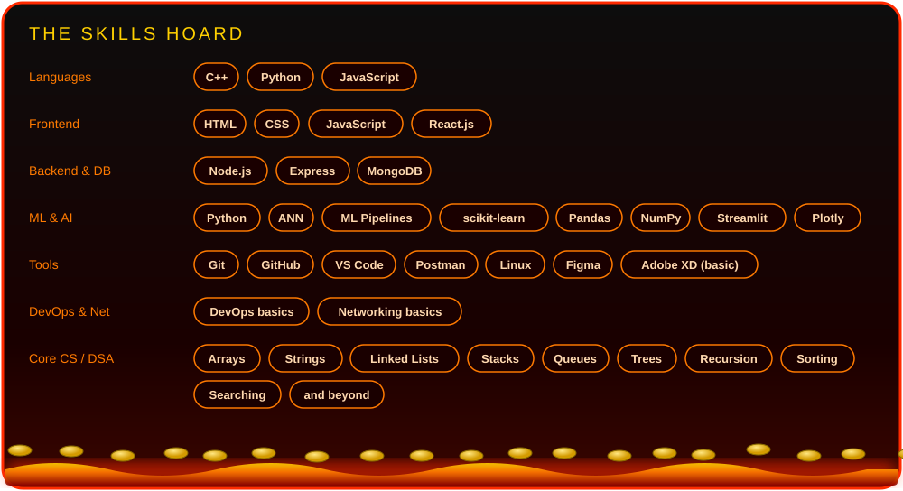

  

  

  

<h2 align="center">🐉 The Dragon Rider</h2>

I build scalable web systems and ML-powered apps, and I've solved <b>750+ DSA problems</b> in C++ along the way. 
Give me a messy problem and I'll break it down, ship a clean solution, and torch the bugs on the way out. 
Full-stack with React, Node and MongoDB, plus ANN and ML pipelines served through Streamlit. 
<i>Code. Conquer. Repeat.</i>

<h2 align="center">🔥 Battle Stats</h2>

  
  
   
  
   
  
    
  

<h2 align="center">⚔️ Tech Arsenal</h2>

  

  <h3>Languages</h3>
  

  <h3>Frontend</h3>
  

  <h3>Backend and DB</h3>
  

  <h3>ML and Data</h3>
  
   
  
  

  <h3>Tools</h3>
  

<h2 align="center">🏰 Featured Projects</h2>

<table align="center">
<tr>
<td width="50%" valign="top">
<h3>🌐 Personal Portfolio Website</h3>
15+ interactive components, 30% faster page load, responsive across 5 device sizes.  
  
<a href="<PORTFOLIO_REPO_URL>">Code</a> · <a href="<PORTFOLIO_URL>">Live</a>
</td>
<td width="50%" valign="top">
<h3>🐍 Snake Game</h3>
Score tracking, 3 difficulty levels and collision detection.  

  
<a href="<SNAKE_GAME_REPO_URL>">Code</a> · <a href="<SNAKE_GAME_LIVE_URL>">Play</a>
</td>
</tr>
<tr>
<td width="50%" valign="top">
<h3>📊 ML Pipeline Dashboard</h3>
Interactive ANN / ML pipeline dashboard built for exploring models end to end.  

  
<a href="<ML_DASHBOARD_REPO_URL>">Code</a> · <a href="<ML_DASHBOARD_LIVE_URL>">Live</a>
</td>
<td width="50%" valign="top">
<h3>🤝 Sahyog</h3>
Cooperative-owned gig and service marketplace with a multi-path professional verification flow.  
  
<a href="<SAHYOG_REPO_URL>">Code</a> · <a href="<SAHYOG_LIVE_URL>">Live</a>
</td>
</tr>
<tr>
<td colspan="2" valign="top">
<h3>⚔️ DSA Solutions (C++)</h3>
750+ solved problems, organised by topic, written for speed and clarity.  
  
<a href="<DSA_REPO_URL>">Code</a>
</td>
</tr>
</table>

<h2 align="center">💀 DSA and Competitive Programming</h2>

  
  
  
    
  <b>⚔️ 750+ dragons slain. Next target: 1000.</b>
    
  <a href="https://leetcode.com/u/<LEETCODE_USERNAME>">
    ?theme=dark&font=Fira%20Code&ext=heatmap" alt="LeetCode stats"/>
  </a>
    
  
  
  
  
  
  
  
  
  

<h2 align="center">🐍 The Serpent Eats My Contributions</h2>

  <picture>
    <source media="(prefers-color-scheme: dark)" srcset="https://raw.githubusercontent.com/Shixit786/Shixit786/output/snake-dark.svg"/>
    <source media="(prefers-color-scheme: light)" srcset="https://raw.githubusercontent.com/Shixit786/Shixit786/output/snake-light.svg"/>
    
  </picture>

<h2 align="center">🔭 Currently Forging</h2>

🔥 Turning ANN and ML pipelines into clean, interactive Streamlit apps 
🔥 Building Sahyog: a cooperative gig marketplace with multi-path professional verification 
🔥 Scaling Node.js, Express and MongoDB backends 
🔥 Pushing my DSA count from 750+ towards 1000

<h2 align="center">📜 Send a Raven</h2>

  <a href="<LINKEDIN_URL>"></a>
  <a href="mailto:<YOUR_EMAIL>"></a>
  <a href="https://leetcode.com/u/<LEETCODE_USERNAME>"></a>
  <a href="<PORTFOLIO_URL>"></a>

 

  

